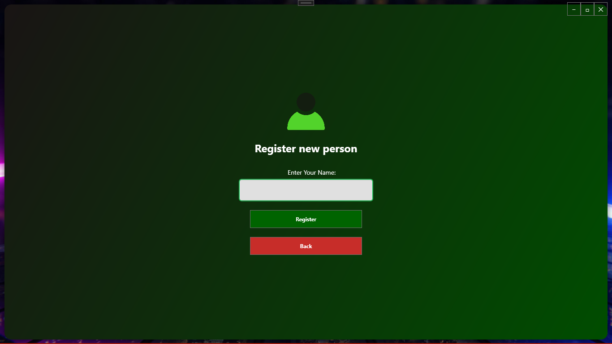
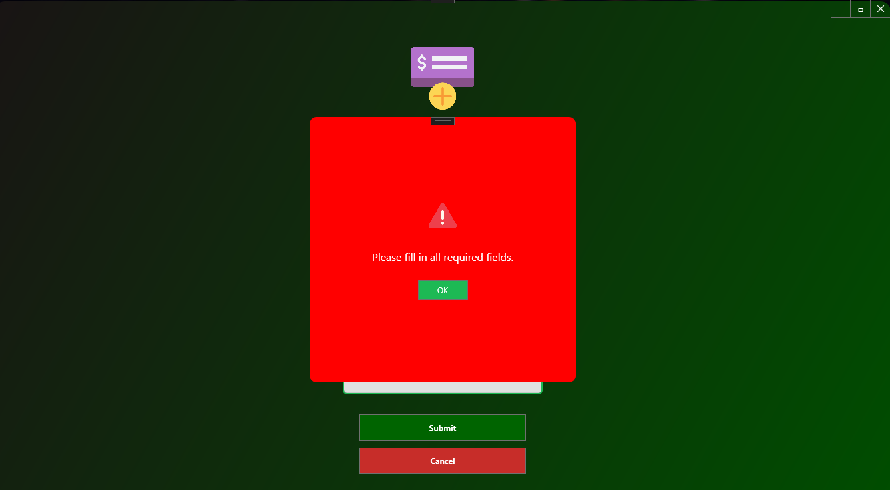
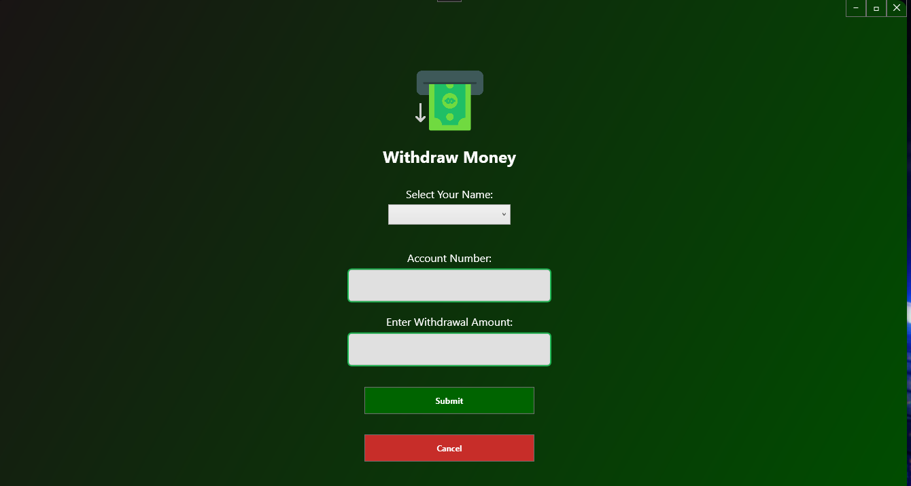

# 🌟 Welcome to Siyakhula Financial 🌟

 <!-- Replace with your image URL -->

### 💼 Revolutionizing Financial Growth in the Digital Age

Welcome to **Siyakhula Financial**, the premier platform that brings your financial transactions to life with trust, growth, and security. With our state-of-the-art banking system, you can manage your finances effortlessly and efficiently.

---

## 📱 Features

### 🔐 Secure and Reliable Banking:
- Encrypted transactions for ultimate security 🔒
- Integrated trust certificate for data protection 🛡️

### 💳 Seamless Transactions:
- Transfer funds to other accounts in seconds 💸
- View account details and balances instantly 🧾

### 🏦 Comprehensive Account Management:
- Manage multiple accounts from one dashboard 📊
- Personalized account options tailored to your financial needs ✍️

### 🌐 Built for the Future:
- Responsive UI for desktop 💻
- Scalable architecture for growing demands 📈

 

---

## 🔧 Installation and Setup

Follow these steps to set up **Siyakhula Financial** on your local machine.

1. Clone the repository**:
   ```bash
   git clone https://github.com/Philani56/Siyakhula-Financial.git
    ```

2. Navigate to the project directory:
   ```bash
   cd Siyakhula-Financial
    ```
3. Restore dependencies:
   ```bash
   dotnet restore
    ```

## 🛠️ Technologies Used
- C# with .NET Framework for backend development ⚙️
- WPF for the desktop user interface 🎨
- SQL Server for secure and scalable data management 🗄️
- GitHub Actions for CI/CD automation 🚀

## 🎨 App UI Design
Our user-friendly interface is designed to make your financial management experience smooth and intuitive.

- Modern UI elements for a clean, crisp design 🖼️
- Dark and light modes for personalized visual comfort 🌗
- Advanced scrollable layouts for seamless navigation 📜

## 📖 User Guide

1. **Login/Register**: Sign up with your personal details to create an account or log in if you’re an existing user.
2. **Account Overview**: Check your balance, recent transactions, and manage accounts.
3. **Transfer Funds**: Easily transfer money between accounts or to external recipients.



 



 



 

## 🤝 Contributing
We welcome contributions! If you'd like to contribute, feel free to fork the repository and submit a pull request. You can also open an issue for any bugs or feature requests.

1. Fork the repository.
2. Create your feature branch (`git checkout -b feature/new-feature`).
3. Commit your changes (`git commit -m 'Add new feature'`).
4. Push to the branch (`git push origin feature/new-feature`).
5. Open a Pull Request.

📜 License
This project is licensed under the MIT License - see the LICENSE file for details.

## 📫 Contact
For any questions or support, feel free to reach out:

- Email: khumalophilani580@gmail.com
- Linkedin: https://www.linkedin.com/in/nhlakanipho-philani-khumalo-679726224/


